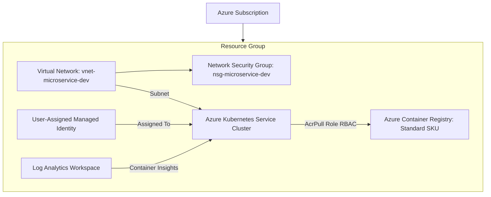

# Azure Microservices Landing Zone with Azure Bicep

This repository provides an enterprise-ready, modular **Azure Bicep** Infrastructure as Code (IaC) solution for deploying a Microservices Landing Zone on Azure.

## 🏗️ Infrastructure Architecture

The deployment automatically provisions and connects the following core Azure resources:



---

## 📁 Repository Directory Structure

```text
.
├── main.bicep                  # Subscription-level deployment orchestrator
├── main.bicepparam             # Development environment parameter file
├── prod/
│   └── main.prod.bicepparam    # Production environment parameter specifications
├── modules/
│   ├── resourceGroup.bicep      # Resource Group creation module
│   ├── network.bicep            # Virtual Network, Subnets, and NSG module
│   ├── identity.bicep           # User-Assigned Managed Identity module
│   ├── acr.bicep                # Azure Container Registry module
│   ├── logAnalytics.bicep       # Log Analytics Workspace module
│   ├── aks.bicep                # AKS cluster module (Azure CNI Overlay & Workload Identity)
│   └── roleAssignment.bicep     # AcrPull RBAC Role Assignment module
├── azure-pipelines/
│   └── azure-pipelines.yml      # Azure DevOps Production Pipeline (Gated PR Plan & Deploy)
├── .github/workflows/
│   └── deploy-and-scan.yml      # GitHub Actions CI/CD workflow
└── README.md                   # Documentation
```

---

## 🔒 Enterprise Best Practices Included

1. **Modular Architecture**: Clean separation of concerns across reusable `.bicep` modules under `modules/`.
2. **Passwordless ACR Integration**: Automatically grants the `AcrPull` role (`7f951dda-4ed3-4680-a7ca-43fe172d538d`) to the AKS Kubelet Identity over the ACR scope—eliminating static credentials/secrets.
3. **Enhanced Security**:
   - ACR Admin User is **disabled** (`adminUserEnabled: false`).
   - AKS uses **User-Assigned Managed Identity**.
4. **Modern Kubernetes Setup**:
   - **Azure CNI Overlay** networking for efficient IP address consumption.
   - **OIDC Issuer** & **Azure Workload Identity** enabled for passwordless microservices authentication to Azure services (Key Vault, SQL, Storage).
5. **Observability & Monitoring**:
   - **Log Analytics Workspace** integrated with AKS Container Insights enabled (`omsagent`).
6. **Autoscaling System Pool**:
   - System node pool equipped with `VirtualMachineScaleSets` and `enableAutoScaling` (`minCount: 2`, `maxCount: 5`).

---

## 🚀 Deployment Instructions

### Prerequisites
- [Azure CLI](https://learn.microsoft.com/en-us/cli/azure/install-azure-cli) (v2.50.0 or higher) with Bicep installed (`az bicep install`)
- An active Azure Subscription with **Owner** or **User Access Administrator** + **Contributor** permissions to assign RBAC roles.

### 1. Authenticate to Azure and Select Subscription
```bash
az login
az account set --subscription a60bfb4b-160f-44e7-979b-775bdd787c90
```

### 2. Validate / Preview Deployment (What-If)

#### PowerShell (Windows)
```powershell
az deployment sub what-if `
  --location koreacentral `
  --template-file main.bicep `
  --parameters main.bicepparam
```

#### Bash (Linux/macOS)
```bash
az deployment sub what-if \
  --location koreacentral \
  --template-file main.bicep \
  --parameters main.bicepparam
```

### 3. Deploy Landing Zone

#### PowerShell (Windows)
```powershell
az deployment sub create `
  --name "microservices-landingzone-deployment" `
  --location koreacentral `
  --template-file main.bicep `
  --parameters main.bicepparam
```

#### Bash (Linux/macOS)
```bash
az deployment sub create \
  --name "microservices-landingzone-deployment" \
  --location koreacentral \
  --template-file main.bicep \
  --parameters main.bicepparam
```

---

## ⚡ Post-Deployment Setup & Verification

### 1. Get Kubernetes Credentials
Connect `kubectl` to your newly deployed AKS cluster:

```bash
az aks get-credentials \
  --resource-group rg-microservice-dev \
  --name aks-microservice-dev
```

Verify node status:
```bash
kubectl get nodes
```

### 2. Test ACR Image Pull Capabilities
Authenticate your container environment with ACR:

```bash
az acr login --name acrmicroservicedev2026
```

Build and test pulling images directly within Kubernetes deployments without needing `imagePullSecrets`!

---

## 🔧 Customization Parameters

Modify `main.bicepparam` or pass custom parameters during deployment:

| Parameter | Type | Default Value | Description |
|---|---|---|---|
| `location` | `string` | `eastus` | Azure deployment region |
| `environment` | `string` | `dev` | Environment label (`dev`, `stage`, `prod`) |
| `projectPrefix` | `string` | `microservice` | Prefix used across resource names |
| `resourceGroupName` | `string` | `rg-microservice-dev` | Name of Resource Group created |
| `acrSku` | `string` | `Standard` | ACR Pricing tier (`Basic`, `Standard`, `Premium`) |
| `systemVmSize` | `string` | `Standard_D2s_v5` | VM SKU for system node pool |
| `minNodeCount` | `int` | `1` | Minimum nodes in system pool |
| `maxNodeCount` | `int` | `3` | Maximum nodes in system pool |

---

## 🤖 CI/CD Automation & Security Scanning

This repository includes a GitHub Actions workflow: [`.github/workflows/deploy-and-scan.yml`](file:///.github/workflows/deploy-and-scan.yml).

### Security Tools Integrated
- **Gitleaks**: Scans commits and history for hardcoded secrets, tokens, or credentials.
- **Checkov**: Static security analysis for Infrastructure as Code (Bicep/ARM).
- **Trivy**: Scans for misconfigurations and security vulnerabilities in IaC templates.
- **Bicep Linter**: Built-in syntax & compilation check via Azure CLI (`az bicep build`).

### Required GitHub Repository Secrets
For automated deployment via GitHub Actions using Azure OIDC (passwordless federation), add the following secrets to your GitHub repository settings (**Settings > Secrets and variables > Actions**):

- `AZURE_SUBSCRIPTION_ID`: `a60bfb4b-160f-44e7-979b-775bdd787c90`
- `AZURE_TENANT_ID`: `cf95a022-f760-4c81-b527-b8d8a9caddc2`
- `AZURE_CLIENT_ID`: `f31102d6-37cd-4d5a-85c5-f0a5bb3ff6f2`

